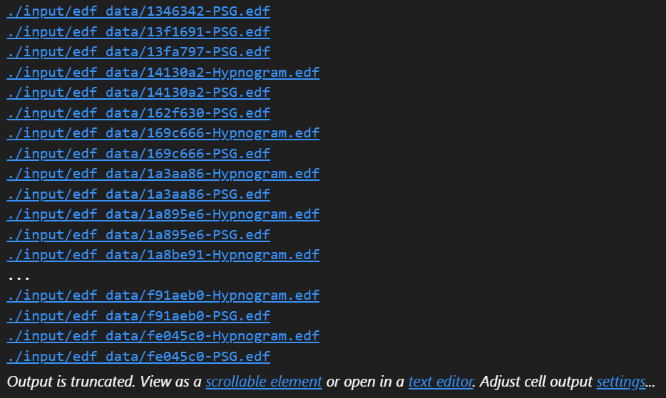
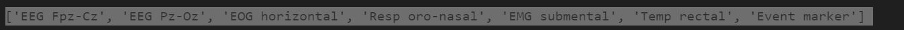
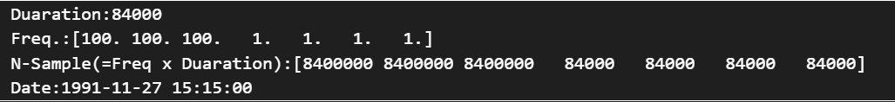

# PSDデータの収集

また、利用データとしては、脳波をとるのは難しく期間を鑑みても実現性が低いと考えたため、下記のデータを利用します。

医学研究データリポジトリであるPhysioNetで、オープンデータとして公開されているSleep-EDF Database Expanded（sleep-cassette サブセット）を利用します
(https://www.physionet.org/content/sleep-edfx/1.0.0/)


# PSDデータの可視化

まずは、収集してきたPSDデータを検出するプログラムを作成した
```Python
import os

def find_edf_files(path):
    edf_files = []
    for root, dirs, files in os.walk(path):
        for file in files:
            if file.endswith(".edf"):
                edf_files.append(os.path.join(root, file))
    return edf_files

# ディレクトリのパスを指定
edf_data_path="./input/edf_data/"

# EDFファイルを検索
edf_files = find_edf_files(edf_data_path)

# 結果の出力
for file_path in edf_files:
    print(file_path)
```
その結果、下記のように全てのpdfを取得できた


pyedflibはEdfReaderとEdfWriterの2つに分かれています。
ここではEdfReaderを使用してみる。

EDFファイルは，生体信号・サンプリング周波数・被験者情報・センサ情報など，様々なデータを格納しているため，データを取得するメソッドもたくさんあるようです。

EdfReader
- getNSamples(self)
  - データ点数を返します。
  - [100 200 100 100]のように各チャンネル毎の値が出力されます。
- readAnnotations(self)
- getHeader(self)
  - 被験者情報や機器情報を返します。多分あまり使いません。
- getSignalHeader(self, chn)
  - 引数で指定したチャンネルの情報(センサ名・サンプリング周波数など)を返します。
- getSignalHeaders(self)
  - 上の関数を全チャンネル同時に。
- getTechnician(self)
- getRecordingAdditional(self)
- getPatientName(self)
- getPatientCode(self)
- getPatientAdditional(self)
- getEquipment(self)
- getAdmincode(self)
- getGender(self)
- getFileDuration(self)
  - 計測時間を返します。単位は秒です。
- getStartdatetime(self)
- getBirthdate(self, string=True)
- getSampleFrequencies(self)
- getSampleFrequency(self,chn)
- getSignalLabels(self)
  - センサ名が全てのチャンネル分返ってきます。
- getLabel(self,chn)
  - 指定したチャンネルのセンサ名が返ってきます。
- getPrefilter(self,chn)
  - 指定したチャンネルの前処理に使用したフィルタ情報を返します。
- getPhysicalMaximum(self,chn=None)
- getPhysicalMinimum(self,chn=None)
- getDigitalMaximum(self, chn=None)
- getDigitalMinimum(self, chn=None)
- getTransducer(self, chn)
  - 指定したチャンネルの計測機器の種類を返します。
- getPhysicalDimension(self, chn)
  - 指定したチャンネルの計測データの単位を返します。uV, mAなど。
- readSignal(self, chn, start=0, n=None)
  - 指定したチャンネルの計測データを返します。一番使います。
- file_info(self)
- file_info_long(self)

まずはファイルの読み込み。

使用するライブラリをインストール

```Python
!pip install numpy
!pip install pyedflib
!pip install matplotlib
```

それらを用いてプログラムを作成していく
```Python
import numpy as np
import pyedflib
import matplotlib.pyplot as plt
```

では、プログラムに取り掛かります。
```python
path = "./input/edf_data/da0649f-PSG.edf"

edf = pyedflib.EdfReader(path)
```

取得できるラベルを抽出してみました
```Python 
labels = edf.getSignalLabels()
print(labels)
```


```Python
print("Duaration:"+str(edf.getFileDuration()))
print("Freq.:"+str(edf.getSampleFrequencies()))
print("N-Sample(=Freq x Duaration):"+str(edf.getNSamples()))
print("Date:"+str(edf.getStartdatetime()))
```


