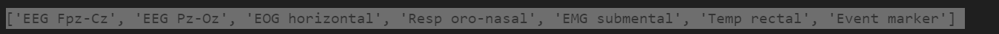

# データの調査

初めに、収集してきたedfデータをはどのようなものか調べていく。
まずは、収集してきたedfをすべて検知し出力する
```Python
import os

def find_edf_files(path):
    edf_files = []
    for root, dirs, files in os.walk(path):
        for file in files:
            if file.endswith(".edf"):
                edf_files.append(os.path.join(root, file))
    return edf_files

# ディレクトリのパスを指定
edf_data_path="./input/edf_data/"

# EDFファイルを検索
edf_files = find_edf_files(edf_data_path)

# 結果の出力
for file_path in edf_files:
    print(file_path)
```
その結果、下記のように全てのpdfを取得できた


pyedflibはEdfReaderとEdfWriterの2つに分かれています。
ここではEdfReaderを使用してみる。

そもそも、EDFファイルは，生体信号・サンプリング周波数・被験者情報・センサ情報など，様々なデータを格納しているため，データを取得するメソッドもたくさんあるようだ。
下記が取得できるメソッドの一覧である。

EdfReader
- getNSamples(self)
  - データ点数を返します。
  - [100 200 100 100]のように各チャンネル毎の値が出力されます。
- readAnnotations(self)
- getHeader(self)
  - 被験者情報や機器情報を返します。多分あまり使いません。
- getSignalHeader(self, chn)
  - 引数で指定したチャンネルの情報(センサ名・サンプリング周波数など)を返します。
- getSignalHeaders(self)
  - 上の関数を全チャンネル同時に。
- getTechnician(self)
- getRecordingAdditional(self)
- getPatientName(self)
- getPatientCode(self)
- getPatientAdditional(self)
- getEquipment(self)
- getAdmincode(self)
- getGender(self)
- getFileDuration(self)
  - 計測時間を返します。単位は秒です。
- getStartdatetime(self)
- getBirthdate(self, string=True)
- getSampleFrequencies(self)
- getSampleFrequency(self,chn)
- getSignalLabels(self)
  - センサ名が全てのチャンネル分返ってきます。
- getLabel(self,chn)
  - 指定したチャンネルのセンサ名が返ってきます。
- getPrefilter(self,chn)
  - 指定したチャンネルの前処理に使用したフィルタ情報を返します。
- getPhysicalMaximum(self,chn=None)
- getPhysicalMinimum(self,chn=None)
- getDigitalMaximum(self, chn=None)
- getDigitalMinimum(self, chn=None)
- getTransducer(self, chn)
  - 指定したチャンネルの計測機器の種類を返します。
- getPhysicalDimension(self, chn)
  - 指定したチャンネルの計測データの単位を返します。uV, mAなど。
- readSignal(self, chn, start=0, n=None)
  - 指定したチャンネルの計測データを返します。一番使います。
- file_info(self)
- file_info_long(self)

まずはファイルの読み込み。

使用するライブラリをインストール

```Python
!pip install numpy
!pip install pyedflib
!pip install matplotlib
```

それらを用いてプログラムを作成していく
```Python
import numpy as np
import pyedflib
import matplotlib.pyplot as plt
```

では、プログラムに取り掛かります。
```python
path = "./input/edf_data/da0649f-PSG.edf"

edf = pyedflib.EdfReader(path)
```

取得できるラベルを抽出してみました
```Python 
labels = edf.getSignalLabels()
print(labels)
```


```Python
print("Duaration:"+str(edf.getFileDuration()))
print("Freq.:"+str(edf.getSampleFrequencies()))
print("N-Sample(=Freq x Duaration):"+str(edf.getNSamples()))
print("Date:"+str(edf.getStartdatetime()))
```


# データの洞察
前項でメタデータが取得できることが分かった。
次にそれらのメタデータが実際にどのようなものなのかを調査していく。

下記のプログラムでは、フォルダに含まれるedfデータをtrainデータとtestデータに分けている。
さらにフォルダ構造を分解していき、edfファイルのメタ情報を取得している
```Python
import datetime
from pathlib import Path
from typing import Dict, List

import pandas as pd
import numpy as np
import warnings
from tqdm.auto import tqdm

from sklearn.model_selection import GroupKFold
from sklearn.ensemble import RandomForestClassifier
from sklearn.metrics import accuracy_score, classification_report, f1_score

import mne

DATA_DIR = Path("./input/")
EDF_DIR = DATA_DIR / "edf_data"

train_record_df = pd.read_csv(DATA_DIR/"train_records.csv")
test_record_df = pd.read_csv(DATA_DIR/"test_records.csv")

# パスを設定
train_record_df["hypnogram"] = train_record_df["hypnogram"].map(lambda x: str(EDF_DIR/x))
train_record_df["psg"] = train_record_df["psg"].map(lambda x: str(EDF_DIR/x))
test_record_df["psg"] = test_record_df["psg"].map(lambda x: str(EDF_DIR/x))

row = train_record_df.iloc[0]

# edfファイルの読み込み
psg_edf = mne.io.read_raw_edf(row["psg"], preload=False)

# 読み込んだデータは、mne.io.edf.edf.RawEDFクラスのインスタンスになります
type(psg_edf)

# infoでメタ情報を表示できます
psg_edf.info
```

上記のプログラムから得られた結果は以下の通り


チャネルの情報が設定されている。その中でも、7つのEEGチャネルがあり、不良チャネルは無かった。<br>
EOGチャネルとECGチャネルの情報は利用できない事も分かる。<br>
サンプリング周波数は100.00 Hzであり、1秒間に取得されるデータポイントの数を表している。<br>
さらに、ハイパスフィルタは0.50 Hzで設定されており、低周波ノイズを除去、ローパスフィルタは100.00 Hzで設定されており、高周波ノイズを除去している。<br>
しかし、測定日時、実験者、参加者、デジタル化されたポイントの可否に関する情報は提供されておらず、未知または利用できない状態となっている。<br>

このように、上記の情報は、与えられたEDFファイルに含まれるデータの性質や品質についての洞察をすることが出来た。